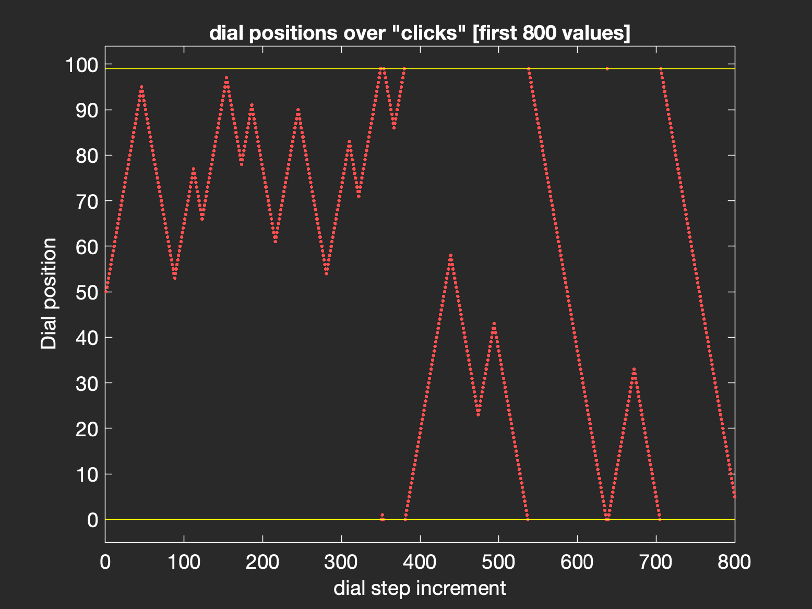

# Day 01

- [Problem description](https://adventofcode.com/2025/day/1)


This problem relates to positions of a dial and left/right rotations.

## Tips

-`textread` works well, but results in a cell array of strings. You can `replace` part of a string with another (e.g. think about what 'R' could become)
- don't forget to convert strings to numbers with `str2double()` (still a cell array after conversion?)
- think about how R and L rotations affect the position of the dial (adding and subtracting to the dial position)
- 99 is the highest possible position and 0 the lowest, so things happen `mod(x, 100)`. Look up *modular arithmetic* if you are not familiar with it.
- remember the starting point of the dial (not 0)

- `cumsum` looks like it might be your friend, but a loop and logical checks might be a better idea

## Second problem

Rather than keeping track of all end points after the rotations, you need to keep track of all the positions visited on the way.

``` matlab
%% idea for part 2 is:
% keep track of all the dial position visited, so
% R50 = +50 becomes a segment 0 + 1:50... careful to keep MOD!
% so +5000 would be 0 + mod(1:5000, 100)
```

- negative rotations need a differnt range (or switch to `rem` from `mod`?)



<details>
<summary>Matlab solution (no peeking!)</summary>
<p>
<a href="solution.m" target="_new">Matlab code / solution</a> for the first part of that problem.
</p>
<p>
<a href="solutionB.m" target="_new">Second part solution</a> of that problem.
</p>

</details>
