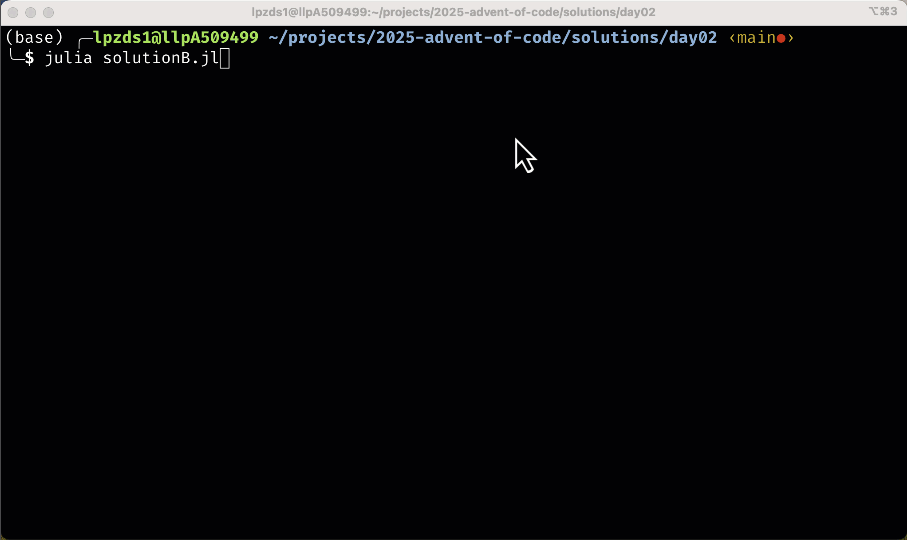

# Day 02

- [Problem description](https://adventofcode.com/2025/day/2)

So - this turns out to be a bit more tricky that I first thought. The problem sounds like it should be ok to solve.

1. You have to parse the file into the pairs. You can do this with `textread()` in matlab by specifying the delimiter as `,` - and you will end up with a piece of text that contains the ranges of IDs. E.g. `11-30` or `12344-14999` or smilar

2. Splitting on the `-` will give you the start and end of the range for each pair. This can be done with `regexp(data,'-','split')` or a similar call

3. Then you can loop over each pair, and generate the list of IDs in that range with `startID:endID` - but be careful here - the IDs can be very large. So you may need to use `uint64` or similar to avoid overflow.

It turns out that doing this in Matlab is a bit of a pain, but `julia` (https://julialang.org/), which is very similar to Matlab, makes this a lot easier because it has built-in support for big integers.

## Tips

- in `matlab`, for a smaller scale problem, you can use `uint64` to represent large integers
- ranges: `1:100` generates a vector of numbers from 1 to 100 ... for most pairs this will work, but some very large numbers will overflow standard integer types
- ``julia``: Use `BigInt(num)` to convert a number to a big integer


## Second problem

The second part of the problem is a bit more tricky. Now you have to find all IDs that are invalid in a more complicated way - any ID that's made up of 2 or more repeating chunks e.g. `1212` (2 chunks of `12`), `123123123` (3 chunks of `123`), `999999` (6 chunks of `9`), `12341234` (2 chunks of `1234`) are all invalid.

- key idea is to subdivide the number (as a string) into sub-chunks of a given size and check if all chunks are the same

- `julia` list comprehension is very useful for this!

```julia
# say
iChunk = 3
nChunks = Int(nDigits / iChunk)
# this will get you a list of all the chunks....
chunks = [SubString(str,1 + (i-1)*iChunk, i*iChunk) for i = 1:nChunks]
```

- if these chunks are all the same, you can check with `unique(chunks)` - if the length of this is 1, then they are all the same! Neat trick.

- This was quite hard because of the size of the numbers and building the ranges. I'd say not a beginner problem at all ...

<center>

</center>


## Code

<details>
<summary>Julia solution (not easy!)</summary>
<p>
<a href="solution.jl" target="_new">Julia code / solution</a> for the first part of that problem.
</p>
<p>
<a href="solutionB.jl" target="_new">Second part solution</a> of that problem.
</p>

</details>
