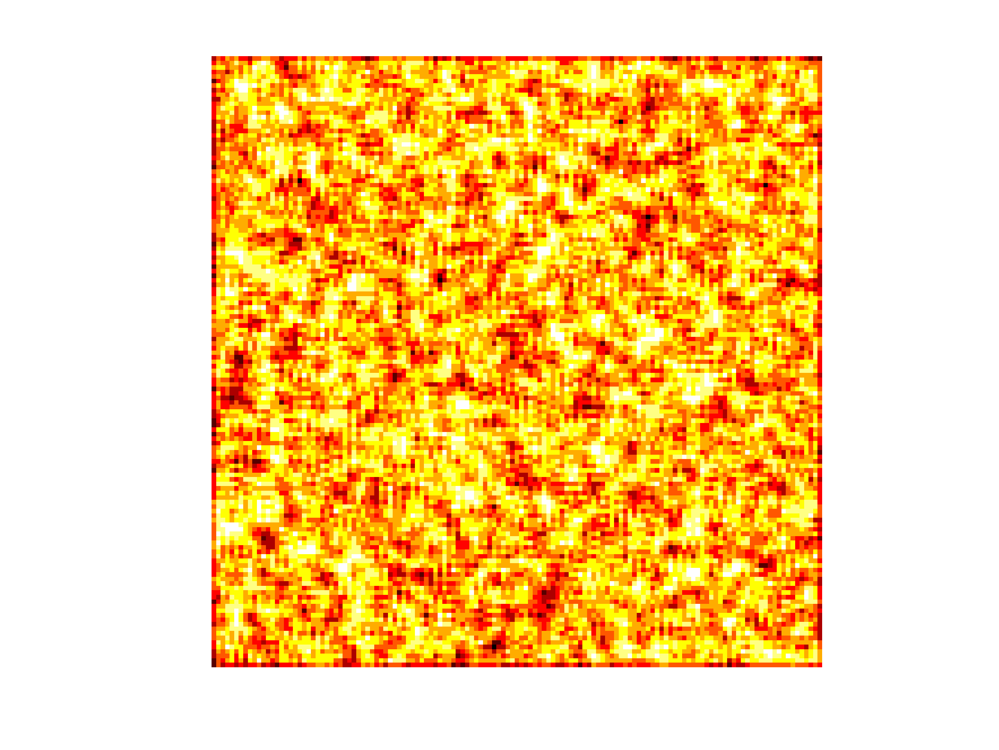
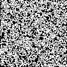

# Day 04

- [Problem description](https://adventofcode.com/2025/day/4)

The elves have stacked the toilet rolls (@) amongst other empty slots (.) in a storage room as shown below:

```
..@@.@@@@.
@@@.@.@.@@
@@@@@.@.@@
@.@@@@..@.
@@.@@@@.@@
.@@@@@@@.@
.@.@.@.@@@
@.@@@.@@@@
.@@@@@@@@.
@.@.@@@.@.
```

To get to them, they need space around them (<4 neighbouring rolls @)

<center>

<br>
<caption>Toilet roll neighbour count from 0 (cold) to 8 (hot)</caption>
</center>


## Tips

- parse the file into a text array and then convert (`replace`) all the positions with `.` by 0 and all the positions with `@` by 1 to get a binary matrix

- this is a classic "convolution" problem - you can use `conv2()` with a 3x3 kernel of ones to count the number of neighbouring rolls for each position

- be careful on how you construct the neighbourhood kernel... and finally

- remember that the neighbour count is only relevant at positions where there is a roll (@ / 1)

- so you will have to combine the neighbourhood information with the current layout of rolls.

## Second problem

The second problem is similar, but now you have to iterate the process described in step 1 until no more rolls can be removed. 

- there are no `do... while` loops in Matlab, but you can start with a `while true` and then `break` when the condition (e.g. `no_more_rolls_removed`) is met

<center>

<br>
<caption>Animated gif showing the iterative removal of toilet rolls by elves ;)</caption>
</center>


## Code

<details>
<summary>Matlab solution</summary>
<p>
<a href="solution.m" target="_new">Matlab code / solution</a> for the first part of that problem.
</p>
<p>
<a href="solutionB.m" target="_new">Second part solution</a> of that problem.
</p>

</details>
