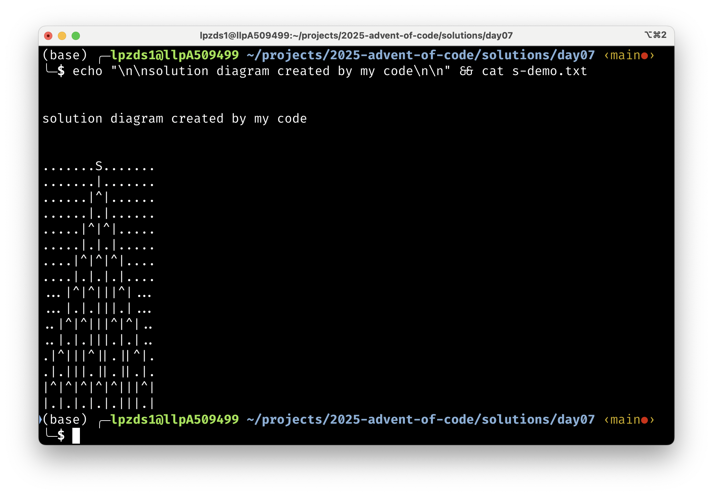

# Day 07

- [Problem description](https://adventofcode.com/2025/day/)

Beamsplitting problem ...

- beams travel in straight lines until they hit a beamsplitter (`^`), which splits the beam into two beams at `i +/- 1`

- puzzle input is a grid of characters, with `S` as the source of the beam.
 
```text
.......S.......
...............
.......^.......
...............
......^.^......
...............
.....^.^.^.....
...............
....^.^...^....
...............
...^.^...^.^...
...............
..^...^.....^..
...............
.^.^.^.^.^...^.
...............
```

- required answer is the # of times a beam has been split when it reaches the bottom row of the grid. (signaled by a beam above a splitter.) So the following pattern would count as one split!

```text
...|...
...^... 
```

## Tips for first problem

1. Parse the input into a matrix of characters.
2. Find the source position `S`. Finde the positions of all splitters `^`.
3. Create a function that simulates the beam travel - row by row, starting from the source position.

4. For each row, check if the beam is above a splitter. If so, split the beam into two beams at `i +/- 1`.

## Second problem

... requires a bit more algorithmic thinking. This is a kind of pathfinding problem, where we need to explore all possible paths the beam can take through the grid. I never had time to learn details about *dynamic programming* which is one of the ways to solve such problems efficiently. And I couldn't find a brute-force way to even try within the day... so I ended up asking chatGPT for help (!) - so the solution for B is actually pretty much entirely written by chatGPT, with some minor modifications by myself.


<center>

</center>


## Code

<details>
<summary>Julia solution</summary>
<p>
<a href="solution.jl" target="_new">Julia code / solution</a> for the first part of that problem (simpler version of the code ended up as solution for B!).
</p>
<p>
<a href="solutionBchatGPT.jl" target="_new">Second part solution</a> of that problem (NB! The actual pathfinding function was written by ChatGPT. Kind of mad - but it worked straight out of the box).
</p>

</details>
