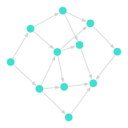
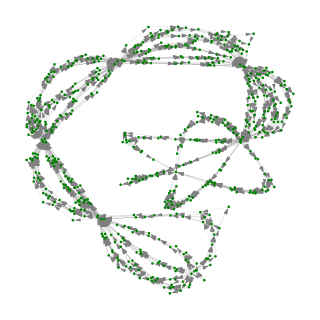
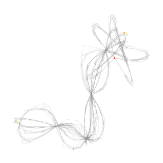

# Day 10

- [Problem description](https://adventofcode.com/2025/day/10)

<center>

</center>

Pathfinding... but this time I made an effort to have a go (not from scratch, but with the help of `Graphs.jl` and `GraphPlot.jl`).


## Tips for first problem

1. Parse the input into lines, the split on the `:` and `,` to get the source node and target nodes. The target nodes are then space separated.
2. It's a directed graph, so edges go from source to each target node. 
3. I used a `Dict{String, Int}` to map node names to integer indices for the graph.

```julia 
g = SimpleDiGraph(length(all_nodes))
# for each node
#.    for each target, add an each 
      add_edge!(g, src_idx, tgt_idx)
```

<center>

</center>

## Second problem

Same setup as the first, but now we need to find *all simple paths* from node `srv` to node `out` but also visit `fft` and `dac` somewhere along the way.

Simple minded approach: given the datastructure above, we can use `all_simple_paths` again, but filter the results to only those paths that contain the required nodes. The only problem is that this is very hard (NP-hard) in general, so brute force is not an option

I tried using a depth-first search with some checks to make sure no self-intersecting paths... but had to get help from ChatGPT to get a working solution (no CS deegree, remeber - haha). 

But I made a nice visualization of the graph to show what's what -- first steps in the right direction, I guess: see below.

```
yellow [start] -> orange [required nodes] -> red [end]
```

<center>

</center>

## Code

<details>
<summary>Julia solution</summary>
<p>
<a href="solution.jl" target="_new">Julia code / solution</a> for the first part of that problem - that was very quick / no hiccups.
</p>
<p>
<a href="solutionB.jl" target="_new">Julia code / non-solution</a> for the second part of that problem. But code shows how to visualize the graph with `GraphPlot.jl` and adjust properties like node color and size.
</p>

</details>
